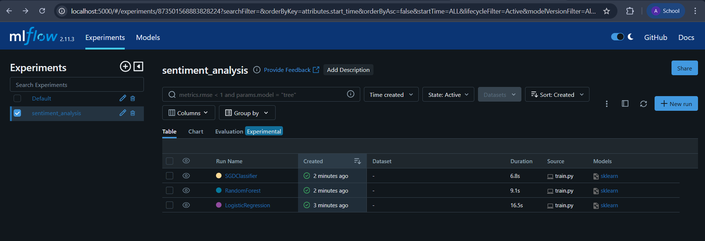
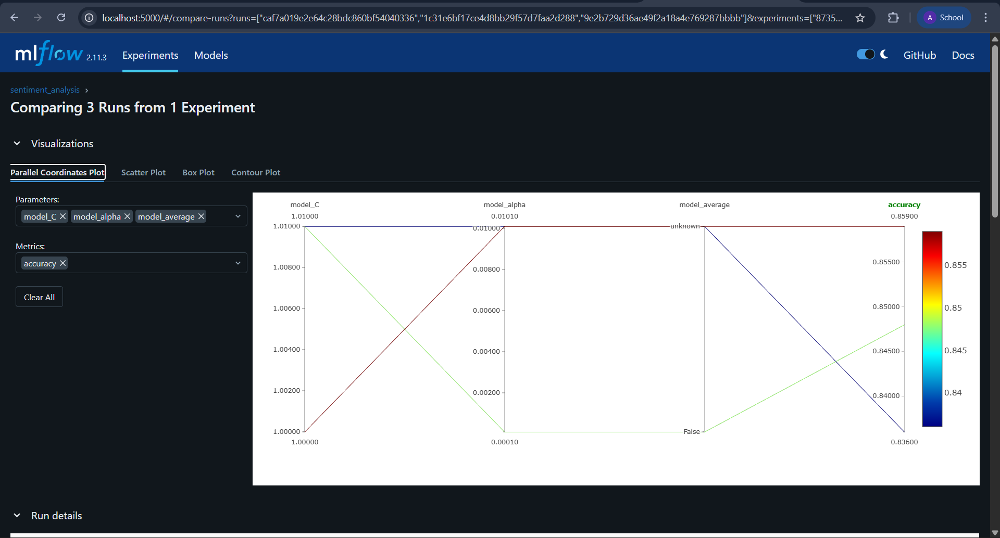

# 🚀 MLOps Sentiment Analysis Pipeline

<div align="center">


*A professional MLOps pipeline demonstrating experiment tracking, model management, and reproducible machine learning workflows*

</div>

## 📊 Overview

This project showcases a complete **MLOps pipeline** for sentiment analysis using IMDb movie reviews. It demonstrates industry-standard practices for experiment tracking, model comparison, and reproducible machine learning workflows using **MLflow**.

## 🎯 Key Features

- **🔬 Systematic Experiment Tracking**: Compare multiple ML algorithms with full parameter and metric logging
- **📈 Model Performance Analysis**: Comprehensive evaluation with accuracy, F1-score, precision, and recall metrics
- **🔄 Reproducible Workflows**: Version-controlled experiments with automatic artifact tracking
- **📊 Visual Analytics**: Automated confusion matrix generation and performance visualization
- **⚡ Production-Ready Code**: Modular, maintainable code structure following software engineering best practices

## 🏗️ Architecture
mlops-sentiment-analysis-pipeline/

├── train.py # Main training pipeline with MLflow integration

├── data_loader.py # Data ingestion and preprocessing

├── evaluate.py # Model evaluation and comparison

├── config.py # Project configuration and paths

├── requirements.txt # Python dependencies

├── notebooks/

│ └── 01_data_exploration.ipynb # EDA and data analysis

└── artifacts/ # Generated plots and model artifacts


## 📈 Model Performance

| Model | Accuracy | F1-Score | Precision | Recall |
|-------|----------|----------|-----------|--------|
| **Logistic Regression** | **85.9%** | **85.9%** | **85.9%** | **85.9%** |
| Random Forest | 83.6% | 83.6% | 83.8% | 83.6% |
| SGD Classifier | 84.8% | 84.8% | 84.8% | 84.8% |

## 🛠️ Technical Stack

- **ML Framework**: Scikit-learn
- **Experiment Tracking**: MLflow
- **Data Processing**: Pandas, NumPy, TensorFlow Datasets
- **Visualization**: Matplotlib, Seaborn
- **Environment Management**: Virtualenv

## 🚀 Quick Start

### Prerequisites
- Python 3.9+
- Git

### Installation & Setup

```bash
# Clone repository
git clone https://github.com/YOUR_USERNAME/mlops-sentiment-analysis-pipeline.git
cd mlops-sentiment-analysis-pipeline

# Create virtual environment
python -m venv mlflow_env
source mlflow_env/bin/activate  # Windows: mlflow_env\Scripts\activate

# Install dependencies
pip install -r requirements.txt
```

### Run the Pipeline

```bash
# 1. Load and prepare data
python data_loader.py

# 2. Train models with experiment tracking
python train.py

# 3. Compare model performance
python evaluate.py

# 4. Launch MLflow UI to view results
mlflow ui --backend-store-uri mlruns --host 0.0.0.0 --port 5000
```
Then open http://localhost:5000 to explore your experiments.

## 📊 MLflow Experiment Tracking
This project demonstrates comprehensive experiment tracking:

- Parameter Logging: Model configurations, hyperparameters, feature engineering settings

- Metric Tracking: Accuracy, F1-score, precision, recall for all experiments

- Artifact Storage: Models, confusion matrices, vectorizers, and training scripts

- Reproducibility: Full environment and code version tracking

### Experiment Dashboard
  

### Model Comparison
 

## 🎯 Business Impact
This pipeline demonstrates skills that are crucial in production ML systems:

- Model Selection: Data-driven approach to choosing the best performing algorithm

- Experiment Reproducibility: Ensure consistent results across different environments

- Performance Monitoring: Track model degradation and retraining needs

- Collaboration: Share experiments and results across data science teams

## Advanced Features
- Modular Architecture: Separated data loading, training, and evaluation components

- Configuration Management: Centralized settings for easy experimentation

- Automated Visualization: Dynamic plot generation for model performance

- Model Serialization: Save and version models for deployment

## 🤝 Contributing
Contributions are welcome! Please feel free to submit pull requests or open issues for improvements.


## 👨‍💻 Author
Your Name

GitHub: @MissBaduwa

LinkedIn: [LinkedIn](https://www.linkedin.com/in/ama-baduwa-baidoo/)

<div align="center">
⭐ If you found this project helpful, please give it a star! ⭐

</div> 
